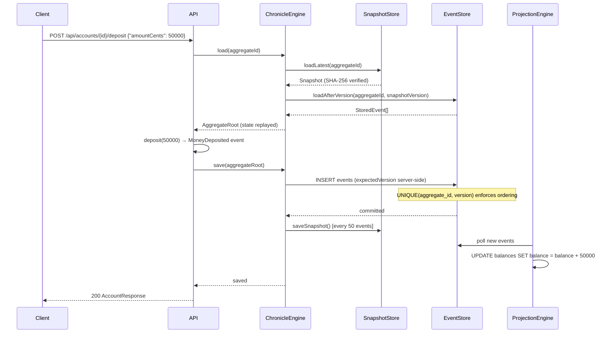
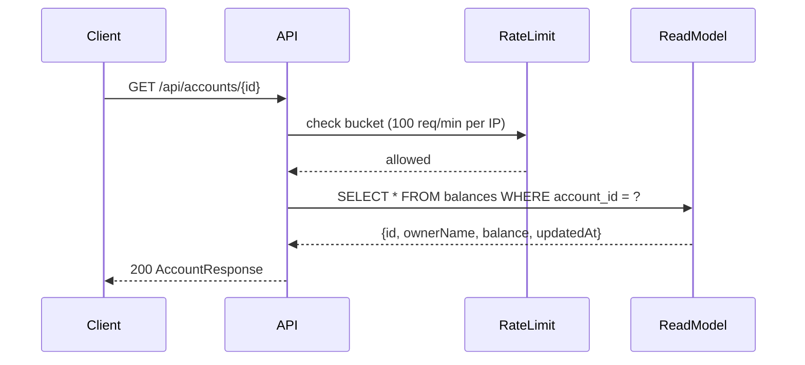
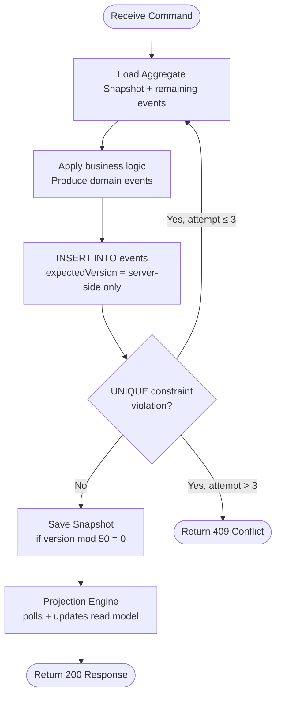
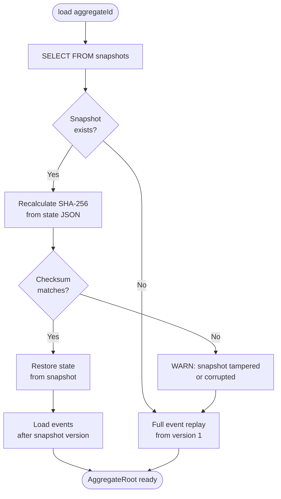

# Chronicle — Embeddable Event Sourcing Engine


Chronicle is a production-grade, embeddable Event Sourcing engine for Java 21 and PostgreSQL. It persists domain events as immutable JSONB records, reconstructs aggregate state via replay, enforces optimistic locking, takes SHA-256-signed snapshots, and drives CQRS read models through an async projection engine.

The `chronicle-example` module demonstrates these capabilities with a fully functional bank account REST API.

---

## What is Event Sourcing?

Traditional systems store the **current state** of an entity. Event Sourcing stores the **sequence of events that led to that state**. This means:

- Every state change is captured as an immutable fact.
- State is reconstructed by replaying events in order.
- The full history of any entity is always available — no data is ever lost.
- Past states can be reconstructed by replaying up to any point in time.

**When to use it:**

- Financial systems where every cent must be auditable
- Complex domains where "why did this happen" matters as much as "what happened"
- Systems requiring temporal queries or rollback to past states
- CQRS architectures where reads and writes scale independently

---

## Architecture

### Module Design

```
chronicle/
├── chronicle-core/      # Zero Spring. Pure Java 21. Interfaces and domain model.
├── chronicle-jdbc/      # PostgreSQL implementation via spring-jdbc.
└── chronicle-example/   # Spring Boot REST API demonstrating the engine.
```

`chronicle-core` has zero Spring dependency — it can be embedded in any Java application. `chronicle-jdbc` provides the PostgreSQL-backed implementation. `chronicle-example` wires everything together with a production-style Spring Boot API.

---

### Write Path — POST /api/accounts/{id}/deposit



---

### Read Path — GET /api/accounts/{id}



---

### Optimistic Locking — Retry Loop



---

### Snapshot Load — Integrity Check



---

## Tech Stack

| Technology | Version | Role |
|---|---|---|
| Java | 21 | Language + records, sealed classes, switch expressions |
| Spring Boot | 3.x | Web, JDBC, Validation, Lifecycle management |
| PostgreSQL | 16 | Append-only event store with JSONB payload |
| Jackson | 2.x | Type-safe, whitelist-only event serialization |
| Flyway | 9.x | Schema migrations (5 migrations, V1–V5) |
| JUnit 5 | 5.x | Unit + integration + adversarial + stress tests |
| Testcontainers | 1.x | Real PostgreSQL in all integration tests — no H2 |
| Bucket4j | 8.x | In-memory rate limiting (100 req/min per IP) |
| springdoc-openapi | 2.x | Swagger UI at /swagger-ui.html |

---

## Getting Started

### Prerequisites

- Java 21
- Docker (for PostgreSQL via docker-compose or Testcontainers)
- Maven (or use the included `mvnw` wrapper)

### Start PostgreSQL

```bash
docker-compose up -d
```

### Run the API

```bash
./mvnw spring-boot:run -pl chronicle-example
```

The API starts on port **8080**. Swagger UI is at:

```
http://localhost:8080/swagger-ui.html
```

### Run All Tests

```bash
./mvnw test
```

### Build

```bash
./mvnw clean package -DskipTests
```

---

## API Examples

### Create Account

```bash
curl -s -X POST http://localhost:8080/api/accounts \
  -H "Content-Type: application/json" \
  -d '{"ownerName":"Alice Smith"}' | jq .
```

```json
{
  "id": "f47ac10b-58cc-4372-a567-0e02b2c3d479",
  "ownerName": "Alice Smith",
  "balanceCents": 0,
  "createdAt": "2026-05-16T22:00:00Z"
}
```

### Deposit

```bash
curl -s -X POST http://localhost:8080/api/accounts/{id}/deposit \
  -H "Content-Type: application/json" \
  -d '{"amountCents":50000,"description":"Salary"}' | jq .
```

### Withdraw

```bash
curl -s -X POST http://localhost:8080/api/accounts/{id}/withdraw \
  -H "Content-Type: application/json" \
  -d '{"amountCents":10000,"description":"ATM"}' | jq .
```

### Transfer

```bash
curl -s -X POST http://localhost:8080/api/accounts/{fromId}/transfer \
  -H "Content-Type: application/json" \
  -d '{"toAccountId":"{toId}","amountCents":5000,"description":"Payment"}' | jq .
```

### Get Account (from read model)

```bash
curl -s http://localhost:8080/api/accounts/{id} | jq .
```

### Get Event History

```bash
curl -s http://localhost:8080/api/accounts/{id}/events | jq .

# Events after version 3
curl -s "http://localhost:8080/api/accounts/{id}/events?after=3" | jq .
```

---

## Event Sourcing Concepts

### Aggregate

An aggregate is a cluster of domain objects treated as a single unit. In Chronicle, aggregates extend `Aggregate<S>` and implement a pure `apply(S state, DomainEvent event)` function that returns a new state without side effects.

### Event

A `DomainEvent` is an immutable record of something that happened. Events are stored once and never modified or deleted. `StoredEvent` wraps the domain event with metadata: `eventId`, `aggregateId`, `version`, `timestamp`, and a JSONB `payload`.

### Snapshot

Snapshots accelerate state reconstruction by capturing the aggregate state at a point in time. Chronicle stores a SHA-256 checksum alongside each snapshot and recalculates it on load — a mismatch triggers a full event replay and a security warning. This detects tampering and storage corruption.

### Projection

Projections consume the event stream and build denormalized read models optimized for queries. The `ProjectionEngine` polls for new events, distributes them to registered projections, and tracks its cursor position so it resumes correctly after a restart. All projections are idempotent — re-delivering an event has no effect.

---

## Security — 8 Layers of Defense in Depth

Chronicle was designed with an adversarial mindset. Every layer is independently secure.

### Layer 1 — Jackson Deserialization Safety

`ObjectMapper` is configured with `FAIL_ON_UNKNOWN_PROPERTIES=true` and `BLOCK_UNSAFE_POLYMORPHIC_BASE_TYPES=true`. The `EventTypeRegistry` is a strict whitelist — only explicitly registered event types can be deserialized. Unknown types throw `IllegalArgumentException`. This prevents gadget-chain RCE (CVE-2017-7525). `activateDefaultTyping()` and `enableDefaultTyping()` are permanently prohibited.

### Layer 2 — Immutable Event Store

Events are written once and never modified or deleted. Immutability is enforced at three independent layers: the `EventStore` interface exposes no `delete()` or `update()` method; a PostgreSQL `REVOKE UPDATE, DELETE` statement removes database-level permissions; and a `BEFORE UPDATE OR DELETE` trigger raises an exception if any mutation is attempted by a privileged user.

### Layer 3 — Optimistic Locking

A `UNIQUE(aggregate_id, version)` constraint in PostgreSQL enforces sequential versioning. `expectedVersion` is always calculated server-side from the aggregate's current version — it is never accepted from the HTTP request body. Concurrent saves from stale reads produce a `DataIntegrityViolationException` which is translated to a `ConcurrentModificationException`. The service layer retries automatically up to 3 times.

### Layer 4 — Snapshot Integrity (SHA-256)

Every snapshot is stored with a SHA-256 checksum of its state JSON. On load, the checksum is recalculated and compared. A mismatch means the snapshot was tampered with or corrupted — Chronicle discards it, logs a `[SECURITY]` warning, and falls back to full event replay. The system is never left in an inconsistent state.

### Layer 5 — Input Validation

All DTOs use Bean Validation annotations (`@NotBlank`, `@NotNull`, `@Min`, `@Max`, `@Size`). Every controller method uses `@Valid` on all `@RequestBody` parameters. Client request bodies may never contain `version`, `aggregateType`, or `eventType` fields — these are server-controlled. Invalid UUIDs in path parameters return 400, not 500.

### Layer 6 — SQL Injection Prevention

Every database query uses prepared statements with `?` placeholders. JSONB payloads are inserted via `PGobject` — never by string concatenation. There is no dynamic SQL in the codebase.

### Layer 7 — Data Exposure Prevention

The API never returns raw JSONB, internal class names, or stack traces. `EventResponse` provides a filtered summary map. `application.yml` sets `server.error.include-stacktrace: never` and `server.error.include-message: never`. Logs contain no PII or complete financial payloads.

### Layer 8 — Rate Limiting and Security Headers

All requests are rate-limited to 100 per minute per IP using Bucket4j. The client IP is read from `HttpServletRequest.getRemoteAddr()` — never from `X-Forwarded-For`, which is spoofable. Every HTTP response includes: `X-Content-Type-Options: nosniff`, `X-Frame-Options: DENY`, `Cache-Control: no-store`, `Content-Security-Policy: default-src 'self'`, and `Server: chronicle`.

---

## Concurrency Model

Chronicle uses optimistic concurrency control — no database-level locks are held during business logic execution.

### How It Works

1. Load aggregate state (snapshot + remaining events).
2. Apply business logic and produce new events.
3. Attempt to save: `INSERT INTO events` with the next expected version.
4. If another writer saved first, PostgreSQL raises a `UNIQUE(aggregate_id, version)` violation.
5. Chronicle translates this to `ConcurrentModificationException`.
6. The service layer retries from step 1, up to 3 times.

### Retry Under High Concurrency

The stress tests show this model handles 10 concurrent writers, each performing 100 operations, with zero data loss. Exponential backoff with random jitter prevents synchronized retry storms. The final event count is always exactly correct — every operation is eventually committed.

### Stress Test Results

| Test | Threads | Operations | Result |
|---|---|---|---|
| Mass deposits | 10 | 100 deposits each | 1000 cents — zero loss |
| Concurrent withdrawals | 5 | 300 cents each from 1000 | Exactly 3 succeed, balance 100 cents |
| Projection convergence | 5 | 50 deposits each (10 cents) | 2500 cents in read model |

---

## Testing

### Test Categories

| Category | Count | Description |
|---|---|---|
| Unit tests (core) | 39 | Serialization, registry, StoredEvent validation |
| JDBC integration | 19 | JdbcEventStore with real PostgreSQL via Testcontainers |
| Domain unit tests | 40 | BankAccount rules, aggregate behavior |
| Engine integration | 16 | ChronicleEngine roundtrip, optimistic locking |
| Projection tests | 19 | Idempotency, resume, reset, concurrent writes |
| API tests | 18 | All endpoints, validation, edge cases |
| Adversarial security | 14 | Penetration testing vectors |
| **Stress tests** | **3** | 10×100 deposits, concurrent withdrawals, projection convergence |
| **E2E integration** | **1** | Full lifecycle via real HTTP (TestRestTemplate) |

All integration tests use **Testcontainers with real PostgreSQL 16**. No H2, no mocks for the database. JSONB and PostgreSQL triggers behave identically in tests and production.

### Security Vectors Tested (PRs #7 and #8)

| Vector | Test |
|---|---|
| Jackson deserialization with `@type` field | `JacksonEventSerializerTest` |
| Unknown event type in registry | `EventTypeRegistryTest` |
| Concurrent EventTypeRegistry access | `EventTypeRegistryConcurrencyTest` |
| StoredEvent oversized payload | `StoredEventTest` |
| SQL injection via payload | `JdbcEventStoreSecurityTest` |
| Events immutable (UPDATE/DELETE blocked) | `JdbcEventStoreSecurityTest` |
| Snapshot checksum tamper detection | `SnapshotSecurityTest` |
| Negative balance invariant | `BankAccountSecurityTest` |
| Self-transfer prevention | `BankAccountSecurityTest` |
| Version injection from client | `ChronicleEngineSecurityTest` |
| Optimistic lock stale read | `ChronicleEngineSecurityTest` |
| Projection idempotency under re-delivery | `ProjectionSecurityTest` |
| Invalid UUID in path → 400 | `AccountApiTest` |
| Extra fields in body → 400 | `AccountApiTest` |
| Malformed JSON → 400, no stack trace | `AccountApiTest` |
| `after=-1` parameter → 400 | `AccountApiTest` |
| Security headers on all responses | `AccountApiTest` |
| Transfer to non-existent account → 404, no debit | `AccountApiTest` |
| Rate limiting (burst) | `AdversarialSecurityTest` |
| Concurrent withdrawals — balance never negative | `ConcurrencyStressTest` |
| 10×100 deposits — zero data loss | `ConcurrencyStressTest` |
| Projection convergence under concurrent writes | `ConcurrencyStressTest` |

---

## Contributing

1. Read the architecture documentation — it is the single source of truth for architecture decisions.
2. Follow TDD: write the test before the implementation.
3. No mocks for the database — use Testcontainers.
4. No `float` or `double` for monetary amounts — always `long` (cents).
5. No `@Autowired` on fields — constructor injection only.
6. Security decisions require a `// [SECURITY]` comment with justification.
7. Every PR must pass `./mvnw test` before merge.

---

## License

MIT — see [LICENSE](LICENSE).
